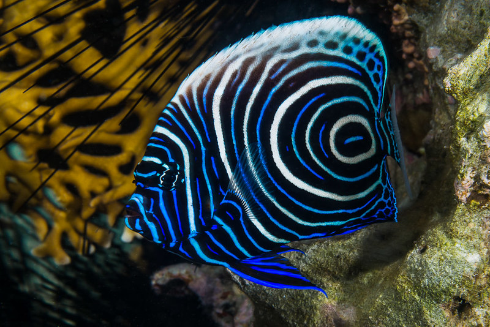

**Distribution:** Indo-Pacific – from the Red Sea to Pitcairn Island.

**Habitat:** Coral reefs and lagoons down to 100 meters deep.

**Size:** Up to 40 cm.

**Diet:** Omnivorous. Feeds on sponges, tunicates, algae, and small invertebrates.

**Conservation Status:** Currently classified as Least Concern by the IUCN, with a stable population trend.

**Fun Facts:**
- Juveniles and adults have completely different color patterns.

- Adults display striking blue and yellow stripes – considered one of the most beautiful angelfish species.

- Highly territorial, usually found alone or in pairs.
