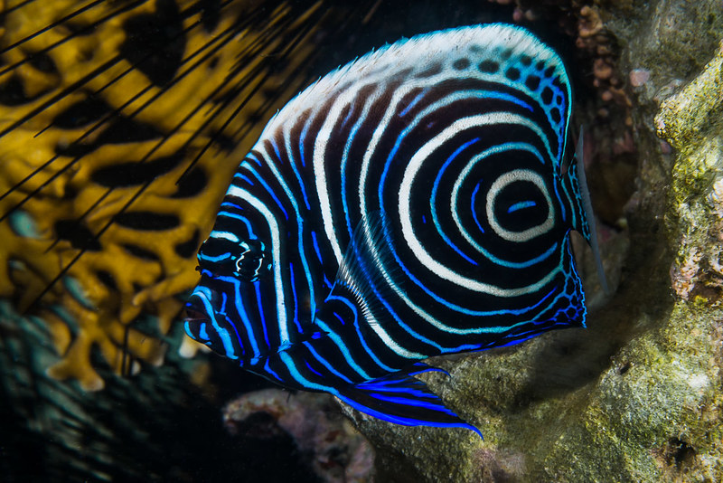

**Razširjenost:** Indo-Pacifik – od Rdečega morja do otoka Pitcairn.

**Habitat:** Koralni grebeni in lagune do globine 100 m.

**Velikost:** Do 40 cm.

**Prehrana:** Vsejed. Hrani se s spužvami, plaščarji, algami in manjšimi nevretenčarji.

**Status ohranjenosti:** Vrsta ni ogrožena in velja za stabilno glede na ocenitve IUCN.

**Zanimivosti:**
- Mlade in odrasle ribe imajo popolnoma različne barvne vzorce.

- Odrasli imajo izrazite modre in rumene proge – eden najlepših angelov.
- Zelo teritorialna riba, pogosto živi sama ali v parih.
