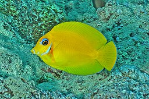

**Distribution:** Indo-Pacific – found from the eastern Indian Ocean and the Great Barrier Reef to French Polynesia, including Indonesia, the Philippines, and Micronesia.

**Habitat:** Inhabits coral-rich lagoons and outer reef slopes, typically at depths of 1 to 60 meters. Prefers areas with abundant coral and rocky structures.

**Size:** Grows up to 25 cm in length.

**Diet:** Omnivorous. Feeds mainly on algae but may also consume detritus and small invertebrates.

**Conservation Status:** Not currently evaluated by the IUCN. Considered common and not under immediate threat.

**Fun Facts:**
- Juveniles are known for their remarkable mimicry of angelfish species (such as *Centropyge flavissimus*), possibly to avoid predation.

- 

- Adults have a distinctive dark "chocolate" body coloration with a bright orange patch behind the eyes, which gives the species its name.
- Like other surgeonfish, it has sharp spines on the caudal peduncle ("tail base") used for defense.
- It plays an important ecological role by grazing algae and helping to maintain the balance on coral reefs.
