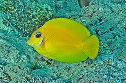

**Razširjenost:** Indo-Pacifik – prisoten od vzhodnega Indijskega oceana in Velikega koralnega grebena do Francoske Polinezije, vključno z Indonezijo, Filipini in Mikronezijo.

**Habitat:** Naseljuje koralne lagune in zunanje grebenske stene, običajno na globinah med 1 in 60 metri. Najraje ima območja z obilico koral in skalnatih struktur.

**Velikost:** Zraste do 25 cm.

**Prehrana:** Vsejed. Prehranjuje se predvsem z algami, včasih pa tudi z detritusom in majhnimi nevretenčarji.

**Status ohranjenosti:** Vrsta trenutno ni ocenjena pri IUCN. Šteje se za pogosto in trenutno ni neposredno ogrožena.

**Zanimivosti:**
- Mlade ribe znane po izjemnem posnemanju drugih vrst angelfish (npr. *Centropyge flavissimus*), verjetno kot obrambni mehanizem pred plenilci.

- 

- Odrasli imajo značilno temno "čokoladno" obarvanost telesa in izrazit oranžen madež za očmi, po katerem je vrsta tudi dobila ime.
- Kot drugi kirurgi ima na korenu repa ostre bodice, ki jih uporablja za obrambo.
- Ima pomembno ekološko vlogo pri ohranjanju ravnovesja na koralnih grebenih, saj s pašo alg preprečuje njihovo prekomerno razrast.
