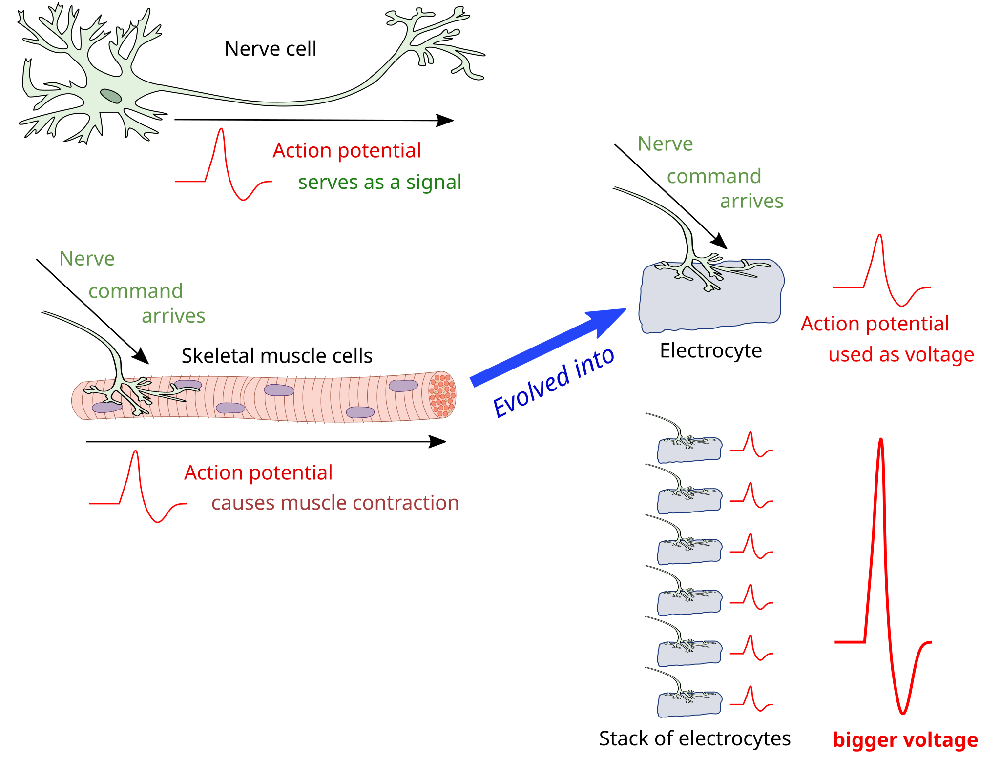

---
common_name: Black ghost knifefish
latin_name: Apteronotus albifrons
cover: ../../../assets/habitats/amazonka/nozarica.jpg
habitat: amazonka/en
--- 
**Distribution:**  
Amazon and Orinoco River basins – mainly in Brazil, Peru, Ecuador, Colombia, and Venezuela.

**Habitat:**  
Dark, slow-flowing rivers (“blackwater”) with dense riparian vegetation, submerged wood, and hiding places. It stays in the lower water layers, often near the bottom.

**Size:**  
Can grow up to 50 cm in the wild, usually 30–40 cm in aquariums.

**Diet:**  
Carnivorous. Feeds on aquatic insects, larvae, small invertebrates, and occasionally small fish.

**Conservation status:**  
Not assessed on the IUCN Red List. Wild populations are currently not threatened, but local pollution and aquarium fishing may impact them.

**Interesting facts:**  
- Has the ability for electrical orientation – it emits weak electric fields to detect its surroundings and prey even in complete darkness. The electric organs in these fish evolved from nerve cells called electrocytes. 

 
- The nickname “black ghost” comes from its elegant, almost black body and its characteristic undulating swimming with the caudal fin.  
- It has white markings on its tail and sometimes on its head, making it easily recognizable.  
- It is a nocturnal fish that prefers to rest in hiding places during the day.
