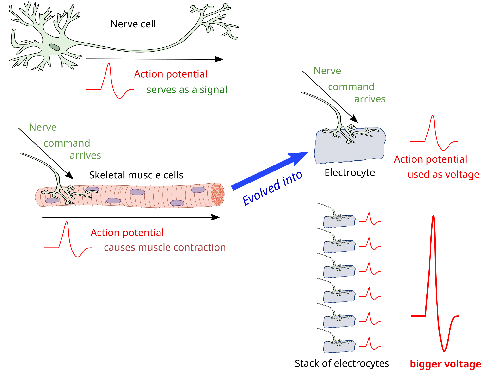

**Razširjenost:**  
Porečje Amazonke in Orinoka – predvsem v Braziliji, Peruju, Ekvadorju, Kolumbiji in Venezueli.

**Habitat:**  
Temne, počasi tekoče reke (“črne vode”) z gosto obrežno vegetacijo, potopljenim lesom in skrivališči. Zadržuje se v spodnjih slojih vode, pogosto v bližini dna.

**Velikost:**  
V naravi lahko zraste do 50 cm, v akvarijih običajno 30–40 cm.

**Prehrana:**  
Mesojed. Hrani se z vodnimi žuželkami, ličinkami, majhnimi nevretenčarji in včasih tudi z majhnimi ribami.

**Status ohranjenosti:**  
Ni ocenjen na IUCN rdečem seznamu. Naravne populacije trenutno niso ogrožene, a lokalno lahko nanje vplivata onesnaženje in ribolov za akvaristiko.

**Zanimivosti:**  
- Ima sposobnost električne orientacije – oddaja šibka električna polja, s katerimi zaznava okolico in plen tudi v popolni temi. Električni organi pri ribah so se razvili iz nevronskih celic, ki jim rečemo elektrocite.  

- Drugo ime za to ribo – “črni duh” – izhaja iz elegantnega, skoraj črnega telesa in značilnega valovitega gibanja s podrepno plavutjo.  
- Ima bele oznake na repu in včasih na glavi, po katerih ga zlahka prepoznamo.  
- Je nočna riba, ki podnevi raje počiva v skrivališčih.  
