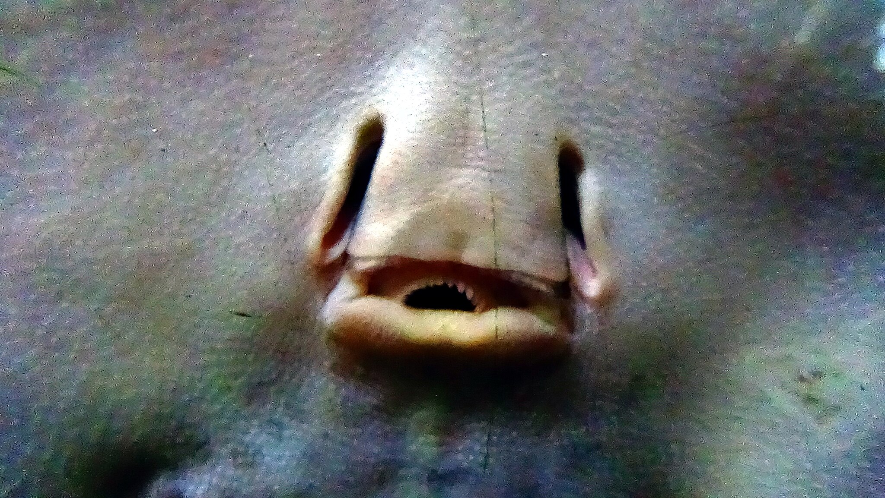

## Razširjenost  
Porečja rek Amazonke, Orinoka in Parana-Paragvaj v Južni Ameriki.

## Habitat  
Sladkovodne reke in pritoki, najraje se zadržuje na peščenem ali blatnem dnu, kjer se lahko zakoplje.

## Velikost  
Premer telesa (diska) običajno doseže do 50 cm, čeprav so poročali tudi o večjih primerkih.

## Prehrana  
Mesojed, mrhovinar. Prehranjuje se z različnimi nevretenčarji (žuželkami, raki, polži) in mrhovino, ki jo najde na dnu.

## Status ohranjenosti  
Po IUCN rdečem seznamu trenutno velja za vrsto s pomanjkljivimi podatki (Data Deficient - DD). To pomeni, da ni dovolj informacij za oceno tveganja izumrtja.

## Zanimivosti  
- Je ena izmed redkih vrst skatov, ki živijo izključno v sladki vodi.  
- Prepoznamo ga po značilnih živobarvnih oranžno-rumenih pegah na temnejši podlagi hrbta. Vzorec je edinstven za vsako žival in se močno razlikuje med posameznimi rekami, saj je odvisen od barve substrata.  
- Na repu ima eno ali več nazobčanih strupenih bodic, ki jih uporablja za obrambo. Vbod je lahko zelo boleč.  
- Je živoroden – samica skoti žive mladiče.  

