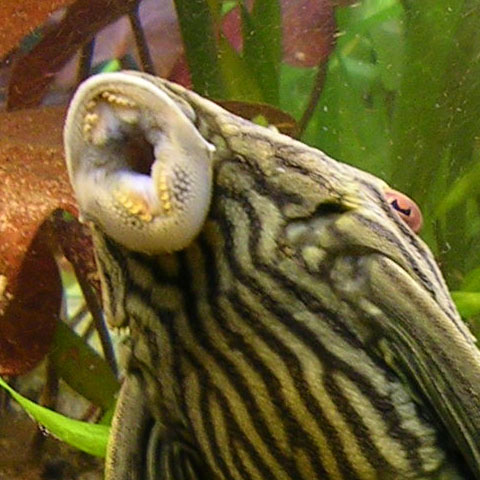

---
common_name: Royal plevo
latin_name: Panaque nigrolineatus
cover: ../../../assets/Habitati/amazonka/kraljevi-som.jpg
habitat: amazonka/en
--- 
**Distribution:**  
Amazon and Orinoco River basins in South America, mainly Brazil, Colombia, and Venezuela.

**Habitat:**  
Slow-flowing rivers and flooded areas with abundant vegetation and submerged wood.

**Size:**  
Can grow up to 43 cm in the wild.

**Diet:**  
Herbivorous. Feeds on algae, wood, and plant material.

**Conservation status:**  
Not specifically evaluated on the IUCN Red List.

**Interesting facts:**  
- Possesses strong teeth adapted for scraping wood, which is rare among fish.  

- Its gut hosts special symbiotic bacteria capable of digesting cellulose.  
- The skin on the dorsal side is transformed into armored plates that protect it from predator attacks.  
- A special color variant of this pleco lives only in the Guaviare River (a tributary of the Orinoco) and is known as the “watermelon pleco” because of its distinctive coloration.
