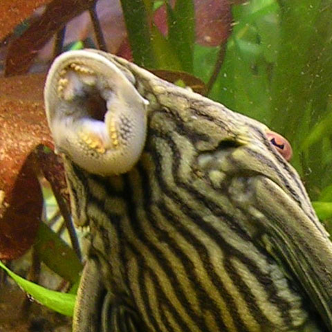

**Razširjenost:**  
Porečje reke Amazonke in Orinoka v Južni Ameriki, predvsem v Braziliji, Kolumbiji in Venezueli.

**Habitat:**  
Počasi tekoče reke in poplavna območja z bogato vegetacijo in potopljenim lesom.

**Velikost:**  
V naravi lahko zraste do 43 cm.

**Prehrana:**  
Rastlinojed. Hrani se z algami, lesom in rastlinskim materialom.

**Status ohranjenosti:**  
Ni posebej ocenjen na IUCN rdečem seznamu.

**Zanimivosti:**  
- Ima močne zobe, prilagojene za strganje lesa, kar je redkost med ribami.  

- V črevesju ima posebne simbiontske bakterije, ki so sposobne presnavljanja celuloze.  
- Kožna na hrbtni strani kraljevskega oklepnega soma je spremenjena v oklepne plošče, ki ga varujejo pred napadi plenilcev.  
- Posebna variacija tega oklepnega soma živi samo v reki Guaviare, pritoku reke Orinoko. Ta variacija je zaradi svoje obarvanosti dobila ime “lubenica pleko” (angl. “watermelon pleco”).
